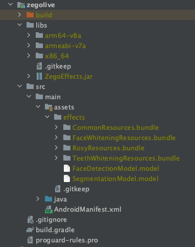
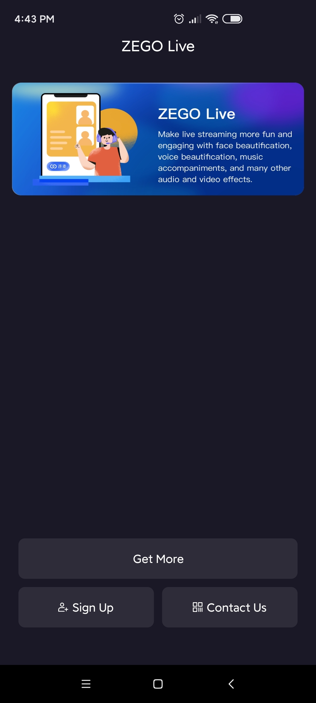

# ZEGO Live

ZEGO Live is a one-stop product that you can use to build interactive live streaming experiences. You can create single-host, multi-host live streaming sessions with audio effects, face beautification, and more features provided by ZEGOCLOUD.

With ZEGO Live, users can create a live room to host, watch live video streaming events, invite participants in the live room to co-host, and more. Participants can send text messages to interact with the host and co-hosts in real time.

ZEGO Live can cover typical scenarios include live video streaming, live online classes, live-stream shopping/e-commerce, or live game streaming.

## Getting started 

Before getting started with the ZEGO Live application, **contact us to activate the ZEGO Live (RTC + IM + Effects) service, get the ZegoEffects SDK, and the resources and models that are required**, and then do the following:

### Prerequisites

* [Android Studio 2020.3.1 or later](https://developer.android.com/studio)
* Android SDK Packages: Android SDK 30, Android SDK Platform-Tools 30.x.x or later.
* An Android device or Simulator that is running on Android 4.1 or later and supports audio and video. We recommend you use a real device (Remember to enable **USB debugging** for the device).
* Create a project in [ZEGO Admin Console](https://console.zegocloud.com/). For details, see [ZEGO Admin Console - Project management](https://docs.zegocloud.com/article/1271).


### Modify the project configurations

1. Clone the ZEGO Live Github repository.
2. Put the ZegoEffects SDK you get in the previous step into the `zegolive/libs` file, and put the resources, and models into the `zegolive/src/main/assets/effects` file.  

3. Open Terminal, navigate to the cloned project repository.
4. Run the configuration script with the `./configure.sh` command. And fill in the AppID, AppSign, and ServerSecret, which can be obtained in the [ZEGO Admin Console](https://console.zegocloud.com/).  
**Note**: If you are using Windows system, double-click the `configure.bat` to run the configuration script.   


### Run the sample code

1. Open the ZEGO Live project in Android Studio.
2. Make sure the developer mode and USB debugging are enabled for the Android device, and connect the Android device to your computer.
3. If the **Running Devices** box in the upper area changes to the device name you are using, which means you are ready to run the sample code.  
4. Run the sample code on your device to experience the ZEGO Live service.  


### Project structure
The project consists of two modules: **app and zegoive**.

#### app
The app module implements the business and UI interaction logic, including login, room list, live streaming, face beautify, sound effects feature, and more. The following shows the structure:

Directory path: 
{your_project_root_path}/live_android/app/src/main/java/im/zego/live:
```
.
├── App.java                ------ App resources, and SDK initialization
├── base
├── constants
├── feature                ------ Business logic of core features 
│ ├── live                ------ Live room related
│ ├── login                ------ Login 
│ ├── room                ------ Room list
│ ├── settings                ------ Settings page
│ └── webview                ------ Web pages presented within the app
├── helper                ------ Utilities
└── view                ------ Customizable UI
```

#### zegolive
The zegolive improves reusability and further encapsulates the RTC, IM, and Effects for you to integrate easier. The following shows the structure:

Directory path: 
{your_project_root_path}/live_android/zegolive/src/main/java/im/zego/live:

```
.
├── ZegoRoomManager.java                ------ Room related instances that used to initialize the SDK, and provide the capabilities for service implementation.
├── ZegoZIMManager.java                ------ The ZIM instances for the SDK use.
├── callback
├── constants
├── helper
├── http
├── listener
├── model
├── service             
│ ├── ZegoDeviceService.java                ------ Streaming and device related service, such as stream publishing, playing and configure audio and video settings. 
│ ├── ZegoFaceBeautifyService.java                ------ Face beautify service
│ ├── ZegoMessageService.java                ------ Real-time messaging service
│ ├── ZegoRoomListService.java                ------ Business server related sercice, such as room list updates, in-room heartbeat and more.
│ ├── ZegoRoomService.java                ------ Room related service, such as join/leave a room, update room information, and more.
│ ├── ZegoSoundEffectService.java                ------  Sound effects service
│ └── ZegoUserService.java                ------ User related service, such as take/leave a seat, turn on/off the microphone/camera, make co-host, and more.
└── util
```

## More documentation
You can find more documentation on our official website: [ZEGO Live (RTC + IM + Effects)](https://docs.zegocloud.com/article/13812).
